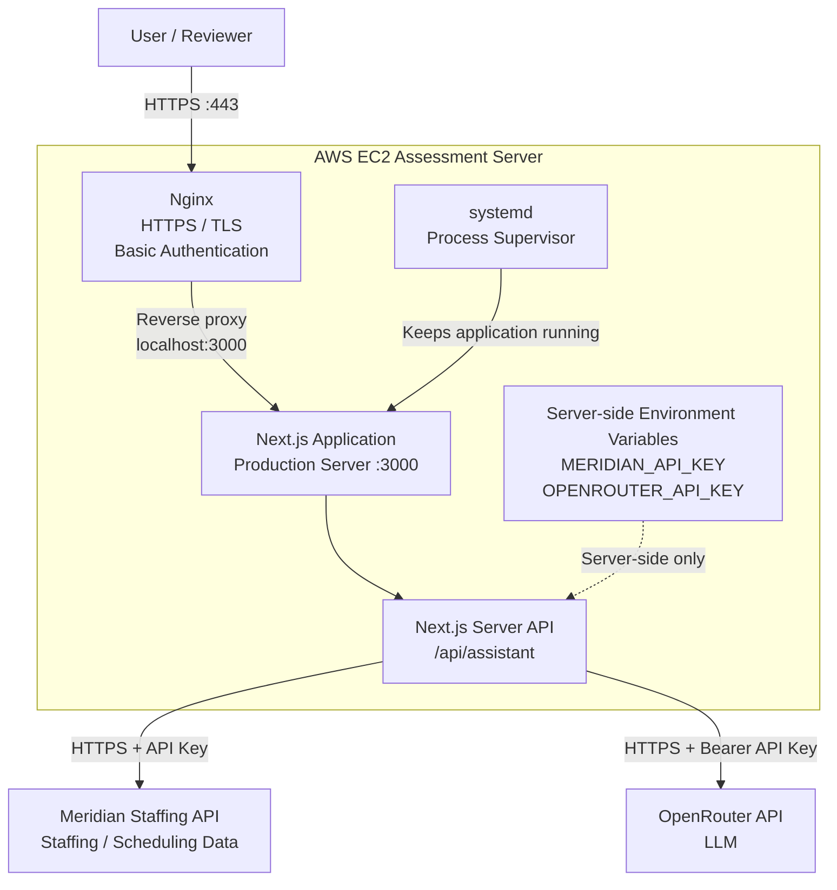

# Meridian Staffing Assistant

Assessment application built with Next.js, TypeScript, Tailwind CSS, and the Vercel AI SDK.

## Architecture



## Local setup

```bash
npm install
cp .env.example .env.local
npm run dev
```

## QA

See `ANSWERS.md` for the six required assessment questions and the recorded production answers.
